<br><br>
<br><br>
<br><br>

# Google Kubernetes Engine CI/CD


## LAB Overview

#### In this lab you will create CI/CD pipeline for building and deploying application on GKE cluster. You will use several GCP services to achieve this goal. The pipeline will look like this:

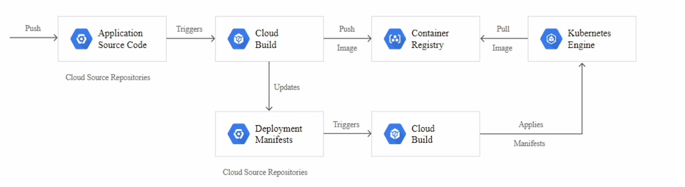

```
Cloud Container Registry - Docker image storage
Cloud Source Repository - application source code, k8s configuration files
Cloud Build - CI/CD service
Google Kubernetes Engine - k8s cluster
```

## Task 0: Prerequisites.

1. Open Cloud Shell in GCP console:

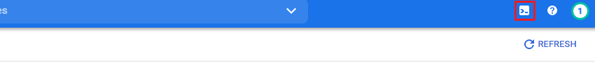

2. Run following command to make sure all required Google APIs are enabled:

```
gcloud services enable container.googleapis.com cloudbuild.googleapis.com sourcerepo.googleapis.com containeranalysis.googleapis.com
```

## Task 1: Create Google Kubernetes Engine cluster.

1. Navigate to ``Compute`` section and select ``Kubernetes Engine``. Create new GKE cluster:

```
Cluster Basics
Name:                   kube-cicd
Location type:          Zonal
Zone:                   europe-west1-b
Static version:         1.18.14-gke.1600

Node pools:             default-pool
Number of nodes:        1
```

2. After configuring cluster parameters, click ``Create``.

## Task 2: Create Cloud Source Repositories for application code and deployment templates.
You will use git source repositories as application code container and for kubernetes deployment templates. Cloud Source Repositories are GCP service providing private git repository.

1. Navigate to ``Tools`` section and select ``Source Repositories``. Enable API if its not enabled yet. Then click ``Get started`` > ``Create repository``:

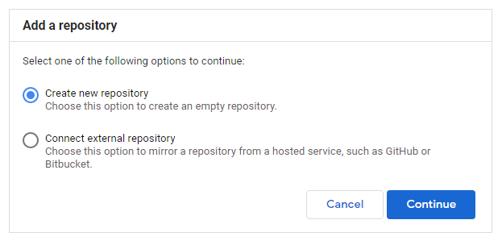

2. Create new repository with name ``kube-web-app`` and select your project.

3. After repository is created, select ``All repositories``:

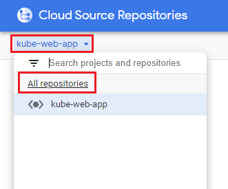

4. And then ``Add repository`` to create another one named ``kube-test-env``:

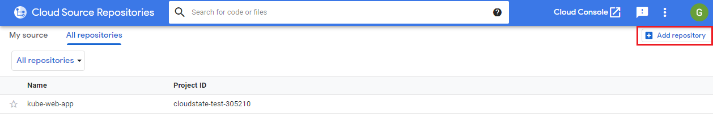

5. After that, when you go back again to ``All repositories``, you should have two repositories in your project:

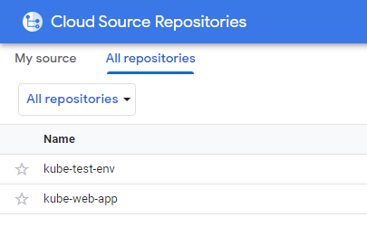

## Task 3. Cloning repositories and pushing application sources.
Now you need to clone both repositories, and first step will be pushing application sources to ``kube-web-app`` repository.

1. Go back to Cloud Shell in GCP console.

2. Run following commands to create catalog for source and to clone repositories (select ``Authorize`` for prompt):

```
mkdir sources
cd sources

gcloud source repos clone kube-web-app
gcloud source repos clone kube-test-env
```

3. Copy files to Cloud Shell using Cloud Console (files will be uploaded to your user catalog - ``~``):

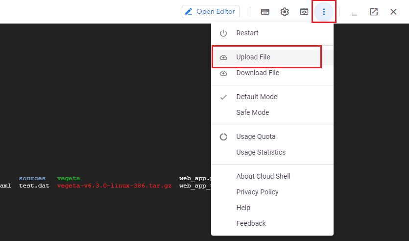

4. Now you can prepare sources for pushing to application repository. Therefore move following files to the created ``kube-web-app`` directory (from ``~`` run commands):

```
mv Dockerfile sources/kube-web-app/
mv web_app.py sources/kube-web-app/
mv web_app_tests.py sources/kube-web-app/

mv kube-build-cicd.yaml sources/kube-web-app/
mv kubernetes.yaml.tpl sources/kube-web-app/
```

5. Next, commit and push files:

```
cd sources/kube-web-app
git add --all
git commit -am "init v1"
git push
```

## Task 4. Create Continuous Integration pipeline.
In this task you will create new CI pipeline using ``Cloud Build`` service.

1. Navigate to section ``Tools`` then ``Cloud Build > Triggers``. In there, create new trigger with following configuration:

```
Name:                                       ci-trigger
Event:                                      Push to branch
Source:                                     kube-web-app
Branch:                                     ^master$          
Build configuration:                        Cloud Build configuration file (yaml or json)
Cloud Build configuration file location:    kube-build-cicd.yaml
```

2. After configuration is done, click ``Create``.

## Task 5. Granting Cloud Build access to GKE and ``kube-test-env`` repository.
Before you set up Continous Delivery part, Cloud Build requires access to GKE cluster and ``kube-test-env`` repository.

1. Your ``PROJECT_ID`` and ``PROJECT_NUMBER`` value is required to complete this task. You can get ``PROJECT_ID`` from context of your Cloud Shell command line, and by using it, create policy binding for Cloud Build service account:

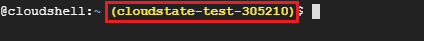

And then get ``PROJECT_NUMBER`` using command:

```
gcloud projects describe <PROJECT_ID> --format='get(projectNumber)'
```

2. After you have ``PROJECT_NUMBER``, add policy binding to Cloud Build service account which will allow ``Cloud Build`` to make deployments to your cluster:

```
gcloud projects add-iam-policy-binding <PROJECT_NUMBER> --member=serviceAccount:<PROJECT_NUMBER>@cloudbuild.gserviceaccount.com  --role=roles/container.developer
```

## Task 6. Granting Cloud Source Repository access for Cloud Build.
Cloud Build requires one more access. It needs to be able to make writes to Cloud Source repositories.

1. To do so, edit ``kube-cicd-env-policy.yaml`` file and past there your ``PROJECT_NUMBER`` value:

```
bindings:
- members:
  - serviceAccount:<PROJECT_NUMBER>@cloudbuild.gserviceaccount.com
  role: roles/source.writer
```

2. After saving changes in ``kube-cicd-env-policy.yaml`` file, grant policy for Cloud Build to ``kube-test-env`` repository with command:

```
gcloud source repos set-iam-policy kube-test-env kube-cicd-env-policy.yaml
```

## Task 7. Initializing ``kube-test-env`` repository.
``kube-test-env`` repository will have two purposes. It will contain two branches, where branch ``candidate`` will have history of all deployment attempts, while branch ``testing`` will have history of all successfull deployments.

1. Go to the cloned ``kube-test-env`` repository catalog and create ``testing`` branch:

```
cd kube-test-env
git checkout -b testing
```

2. Copy ``kube-delivery.yaml`` file to the created branch and push it (from ``~`` catalog, run commands):

```
mv ../../kube-delivery.yaml sources/kube-test-env/
```

3. After file is moved, push changes to the branch ``testing``, and then create another branch ``candidate`` and push it.
```
git add .
git commit -am "CD config"
git push origin testing

git checkout -b candidate
git push origin candidate
```

## Task 8. Creating Continous Delivery pipeline.
In this task you will create another trigger, which will be new CD pipeline using ``Cloud Build`` service.

1. Navigate to section ``Tools`` then ``Cloud Build > Triggers``. In there, create new trigger with following configuration:

```
Name:                                       cd-trigger
Event:                                      Push to branch
Source:                                     kube-test-env
Branch:                                     ^candidate$     
Build configuration:                        Cloud Build configuration file (yaml or json)
Cloud Build configuration file location:    kube-delivery.yaml
```

## Task 9. Update ``kube-web-app`` repository and push changes to trigger CI/CD pipeline.

1. Go to the ``kube-web-app`` sources catalog.

2. Using nano, modify ``web_app.py`` and ``web_app_tests.py``, for example change version in text from ``1`` to ``2`` (in both files):

3. Commit and push changes.

## Task 10. Examine CI/CD pipeline results.

1. Navigate to ``Cloud Build > History`` view. After you push changes to the ``kube-web-app`` branch, there should appear history of calling previously created trigger:

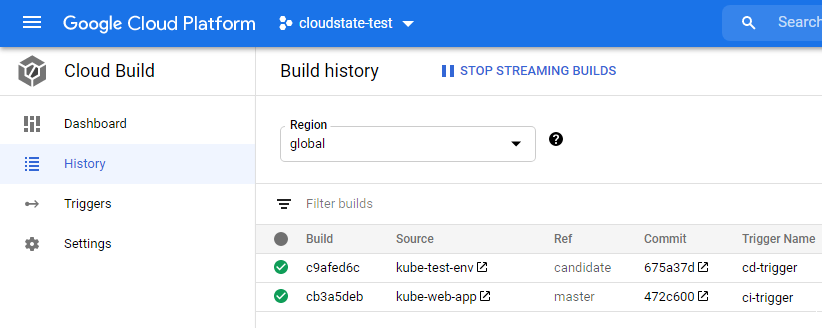

2. You can examine CI part by opening build for trigger ``ci-trigger``. There you can see all the steps that were performed during CI pipeline. If any error appeared during execution, then the exception will be also shown and certain step.

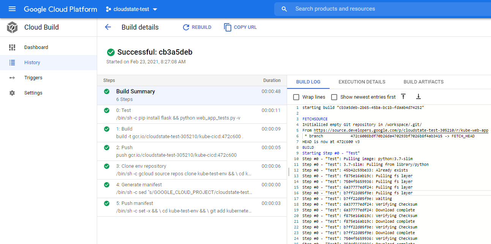

3. You can also examine CD part of pipeline by opening build for trigger ``cd-trigger``.

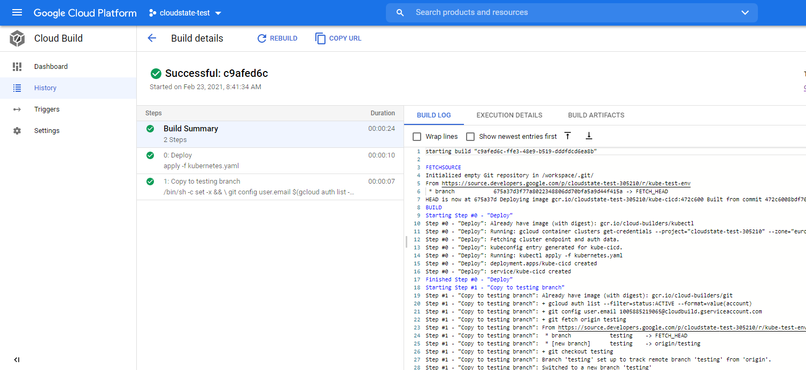

4. Deployment for this kubernetes cluster contained creation of LoadBalancer for your application. In GCP it automatically creates LoadBalancer service which proxies requests incoming to your application. To verify that, navigate to section ``Networking``, ``Networking servicess`` > ``Load Balancing``:

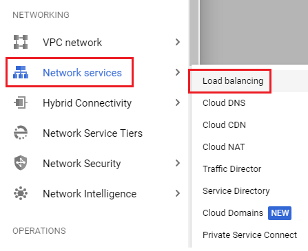

5. There you should see created Load Balancer, with frontend that has assigned public IP address.

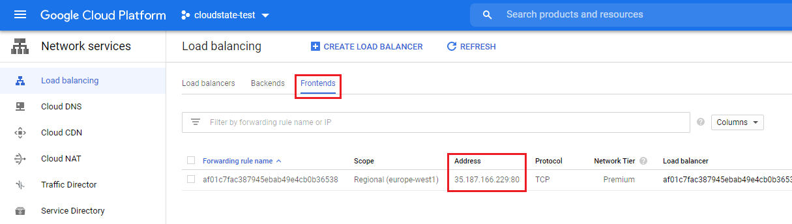

6. Use this address to open new tab in browser and verify that application works. You should see something similar to this:

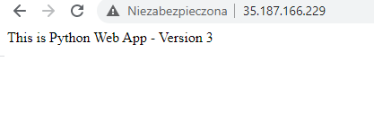

## Task 11. Update ``kube-web-app`` repository and push changes to trigger CI/CD pipeline.

1. Go to the ``kube-web-app`` sources catalog.

2. Using nano, modify only ``web_app.py``, for example change version in text from ``2`` to ``3``

3. Commit and push changes.

4. Examine new cloud build again. See that the build didn't finish because the tests didn't pass.

5. Update ``web_app_tests.py``, set version from ``2`` to ``3`` and commit, push changes.

6. If the build is successful, refresh the application webpage and check if version 3 is deployed. 

## Task 12. Cleanup resources using Cloud Shell.

1. Manually delete ``Load Balancer``.

2. With Cloud Shell delete rest of resources:
```
gcloud source repos delete kube-web-app --quiet
gcloud source repos delete kube-test-env --quiet

gcloud projects remove-iam-policy-binding <PROJECT_NUMBER> --member=serviceAccount:<PROJECT_NUMBER>@cloudbuild.gserviceaccount.com --role=roles/container.developer

gcloud container clusters delete kube-cicd --zone europe-west1-b

gcloud alpha builds triggers delete ci-trigger
gcloud alpha builds triggers delete cd-trigger
```

## END LAB

<br><br>

<center><p>&copy; 2020 Chmurowisko Sp. z o.o.<p></center>
